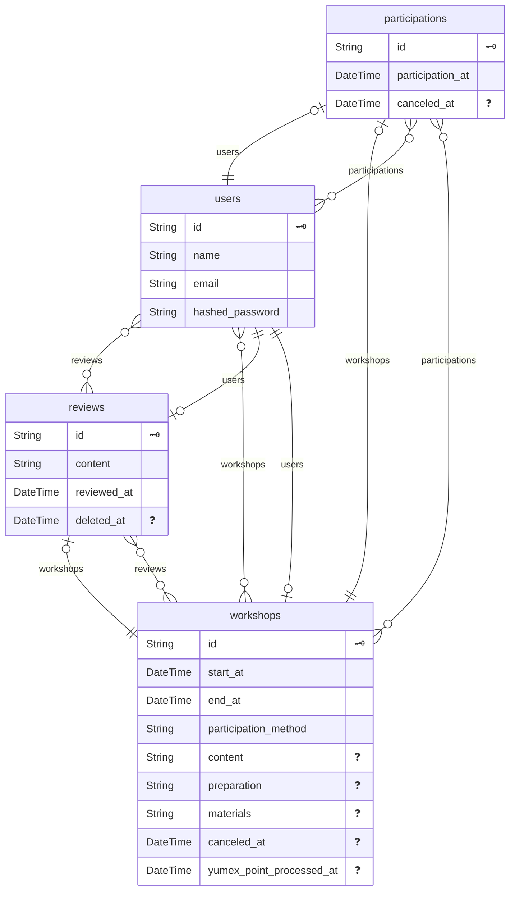

```mermaid
erDiagram

  "participations" {
    String id "🗝️"
    DateTime participation_at 
    DateTime canceled_at "❓"
    }
  

  "reviews" {
    String id "🗝️"
    String content 
    DateTime reviewed_at 
    DateTime deleted_at "❓"
    }
  

  "users" {
    String id "🗝️"
    String name 
    String email 
    String hashed_password 
    }
  

  "workshops" {
    String id "🗝️"
    DateTime start_at 
    DateTime end_at 
    String participation_method 
    String content "❓"
    String preparation "❓"
    String materials "❓"
    DateTime canceled_at "❓"
    DateTime yumex_point_processed_at "❓"
    }
  
    "participations" o|--|| "users" : "users"
    "participations" o|--|| "workshops" : "workshops"
    "reviews" o|--|| "users" : "users"
    "reviews" o|--|| "workshops" : "workshops"
    "users" o{--}o "participations" : "participations"
    "users" o{--}o "reviews" : "reviews"
    "users" o{--}o "workshops" : "workshops"
    "workshops" o{--}o "participations" : "participations"
    "workshops" o{--}o "reviews" : "reviews"
    "workshops" o|--|| "users" : "users"
```
